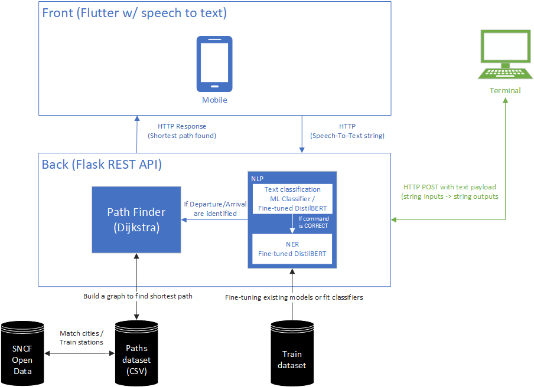

# T-AIA-901

> _Un projet de de recherche et de découverte du domaine du traitement du langage naturel (NLP), de ses applications et de 
ses outils développés au fil des avancées de la recherche._

## Sommaire
- [Groupe](#groupe)
- [Le projet](#le-projet)
  - [Contexte](#contexte)
  - [Architecture](#architecture)
- [Rapport](#rapport)
- [Instructions](#instructions)

## Groupe

Le groupe ayant réalisé l'ensemble du travail de recherche et de développement est composé de 4 membres :
- Eliott CLAVIER
- Maxime MARTIN
- Nathan PIGNON
- Clément MATHÉ

## Le projet

### Contexte

La demande initiale du projet __T-AIA-901__ émane d'une volonté de concevoir une solution capable de naviguer à travers un 
grand nombre des données textuelles, de les comprendre et de les traiter de manière efficace et pertinente pour pouvoir 
classer des __commandes de trajet passées par des utilisateurs__ en __Speech-To-Text__ sur une interface puis d’identifier 
__le départ et l’arrivée de la commande de trajet__ si cette dernière est jugée __valide__. Lorsqu’un départ et une arrivée ont 
été extrait de la commande, __le chemin le plus court en train__ doit être déterminé entre ces deux points.

_A noter que les données textuelles sont issus de jeux de données entièrement créés pour les besoins du projet qui mixent
des données générées aléatoirement à sur des jeux de données existants._

Pour répondre à cette demande, notre approche s’est reposée sur une exploration approfondie des technologies de pointe 
en matière de NLP. Cette exploration nous a conduits à examiner plus particulièrement les tâches de __classification de texte__ et de 
__reconnaissance d'entités nommées (NER)__ pour répondre à notre besoin. Ces tâches ont été appréhendées avec des 
__algorithmes de Machine Learning__ ou des méthodes plus avancées telles que les __réseaux de neurones récurrents (RNN)__, 
__spaCy__ et les modèles de _**transformers**_.

### Architecture

L'architecture du système conçue intègre une interaction front-end/back-end pour le traitement de commandes vocales. Le front-end, développé avec Flutter, active la reconnaissance vocale sur des dispositifs mobiles, convertissant la parole des utilisateurs en requêtes textuelles (Speech-To-Text). Ces requêtes sont ensuite transmises via HTTP au back-end.

Le back-end repose sur une API REST Flask qui orchestre le traitement des données. Il comprend un moteur de traitement du langage naturel (NLP) qui effectue deux tâches principales : la classification de texte et l'extraction d'entités nommées (NER), toutes deux utilisant des modèles DistilBERT finement ajustés sur nos jeux de données pour interpréter correctement les commandes de trajet.

En parallèle, le”'Path Finder” du back-end, s'appuyant sur l'algorithme de Dijkstra, se base sur un graphe pour trouver l'itinéraire le plus court entre des villes ou des gares, en utilisant des données ouvertes fournies par un dataset CSV des chemins possibles fusionnés avec des données des gares françaises disponibles sur SNCF Open Data. Une fois l'itinéraire optimal déterminé, le résultat est renvoyé au front-end sous forme de réponse HTTP, complétant ainsi le cycle de l'interaction utilisateur avec le système.

## Rapport

L'ensemble de notre travail de recherche et d'exploration des technologies de NLP est détaillé dans le rapport de projet
disponible dans le fichier `rapport_nlp.pdf`. 

Ce rapport traite d'abord de nos méthodes de Speech-To-Text et de calcul du chemin le plus court selon un graphe avant 
de présenter le concept de NLP et les différentes méthodes de traitement de texte que nous avons explorées. 

Une grande partie du rapport est dédiée à la présentation de notre méthode génération de données qui est ensuite suivie par la présentation
de l'ensemble de nos expérimentations sur différents aspects du NLP. 

Le rapport conclu sur les choix finaux que nous avons
fait pour répondre à la demande initiale du projet en termes de modèles utilisés pour la classification de commande de trajet et
l'extraction d'entités nommées (départ et arrivée).

## Instructions

Pour lancer le projet, il est nécessaire de lancer le back-end et le front-end.

L'ensemble des instructions pour lancer le projet sont disponibles dans les fichiers `README.md` du dossier `backend` et `mobile`, contentant respectivement le code de notre application Flask et de notre application mobile Flutter.

Des instructions pour pouvoir reproduire nos expérimentations sont également disponibles dans le fichier `README.md` du dossier `ai`,
qui contient également la trace de nos expérimentations.